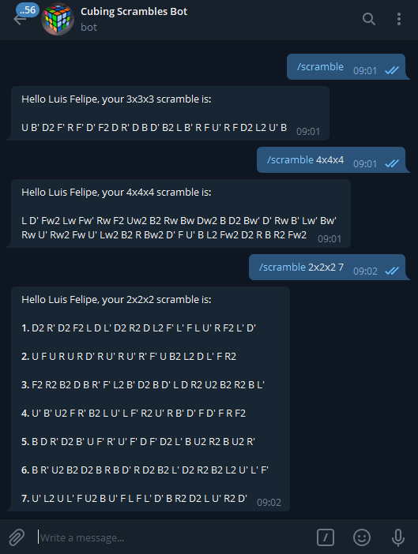

# daily-example-scramble-bot
A simple bot in telegram which send an everyday scramble to cuber groups

---

## Introduction:

Me and my friends have the speedcubing as a hobbie.
To train, we used to generate an scramble and share in our groups to everyone record your different way to solve.

Everyday, the message structure was the same:

```message
Daily Example Solve:
3x3x3

Scramble with the green side in the front and the white side in the top:

L2 F U L2 D B2 D' B' L F L' B D' F' U R B U B L U L B R D
```

An then I've think: "Hmm, that's very automatable. Maybe a bot to to that would be cool".

Initially, the bot just send a message daily in a determined time. But now, it can generate multiple scrambles with multiple cube types.

## Demonstration:



## Notes:

The bot is hosted in my own machine. So I'm trying to found some free server for a simple python script. When I found it, the bot will to work in every time.
